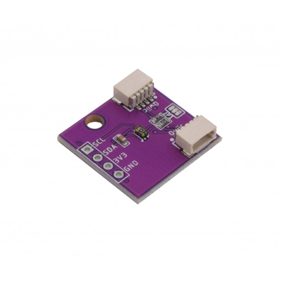

# Zio Qwiic UV Sensor (VEML6075)

> This product can be available for purchase [here](https://www.smart-prototyping.com/Zio-Qwiic-UV-Sensor-VEML6075).
> Note: This sensor is referenced from Sparkfun's Qwiic VEML6075 module's PCB design, check their product link [here](https://www.sparkfun.com/products/14748)

#### Description

This Ultraviolet sensor can be used to detect the intensity of UV A and UV B light waves. The VEML6075 by Vishay has a very good conduct on taking measurements even on a long time solar exposure featuring I2C interface.  It can also output the UVI (Ultraviolet Index, the strength of light radiation at a particular place and time) by doing a simple calculation. The values for UVI range from 0 to 11+, which 6 or above indicate a high radiation index - time to use some sunscreen or even stay indoors!

As most of ZIO boards, it incorporates the Qwiic connector to transfer UV data via I2C, just plug and start taking measurements. Check out the code to setup different UV readings. 

This great little sensor can use either I2C or SPI interfaces so we made it pretty accessible to switch to SPI. Simply solder the header pins provided if you want to!

#### Specification

* Supply Voltage: 3.3V
* Peak Sensitivity UV A: 365nm
* Peak Sensitivity UV B: 330nm
* Operation Temperature Range: -40 to 85°C
* Interface: I2C (address 0x10)
* Dimensions: 20.0 x 20.0mm
* Weight: 1.4g

#### Links

* [VEML6075 Datasheet](https://www.vishay.com/docs/84304/veml6075.pdf)
* [Eagle File and Schematic](https://github.com/ZIOCC/Zio-Qwiic-UV-Sensor-VEML6075)
* [VEML6075 Library](https://github.com/adafruit/Adafruit_VEML6075)

> ###### About Zio
> Zio is a new line of open sourced, compact, and grid layout boards, fully integrated for Arduino and Qwiic ecosystem. Designed ideally for wearables, robotics, small-space limitations or other on the go projects. Check out other awesome Zio products [here](https://www.smart-prototyping.com/Zio).

